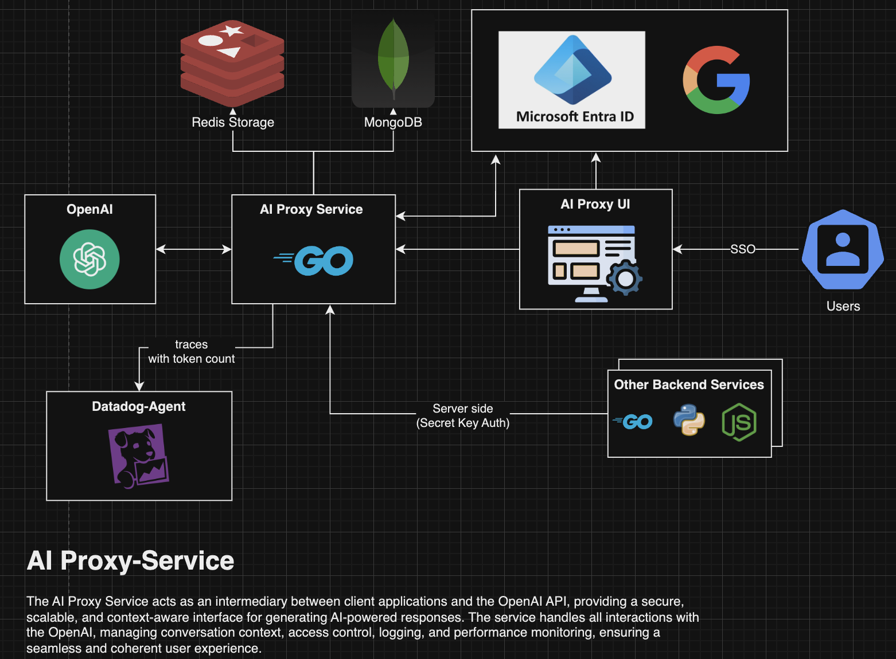

# AI Proxy Service

## Description

The AI Proxy Service is a backend solution designed to securely manage and relay requests to various large language models (LLMs), including GPT-4 via the OpenAI API, while providing the flexibility to integrate other models that follow the OpenAI API standard format. This enables users to easily switch between different LLM providers, whether they are hosted externally or run locally, without major changes to client applications.

The service is stateless and integrates with Single Sign-On (SSO) using Microsoft Entra ID and Google OAuth 2.0 for secure users authentication. It also supports server-side requests from other backend services through secret key-based authentication, making it easy to integrate AI capabilities securely into other systems.

In addition to providing access to multiple AI models, the service enhances their functionality by addressing common limitations like context management, token efficiency, and cost control. Features such as token usage tracking and conversation summarization ensure that tokens are used optimally, reducing costs and improving performance.

## Features
- **Stateless Architecture**: Ensures scalability and performance by maintaining no internal state between requests.
- **SSO Authentication**: Integrates with Microsoft Entra ID and Google OAuth 2.0 to authenticate users securely.
- **Secret Key-based Authentication**: Allows other backend services to securely access GPT-4 using secret key-based authentication.
- **Token Limitations**: Implements token consumption tracking over a specified period, ensuring cost control and preventing overuse.
- **Token Efficiency with Summarization**: The service periodically summarizes after every n conversations to maintain token efficiency. This allows for a streamlined conversation history, reducing the amount of context needed while still retaining relevant information.
- **Model Flexibility**: Supports multiple AI models that adhere to the OpenAI API standard format, providing flexibility to switch between different LLM providers.
- **Context Awareness**: Manages and maintains conversational context across multiple requests by storing relevant information in a separate datastore, simulating long-term memory for conversations.
- **Logging and Monitoring**: Logs requests, responses, and usage metrics, with integrations for observability platforms.
- **Error Handling**: Graceful error handling with clear error messages and status codes.
- **Extensible**: Designed for easy extension with new authentication providers or features.

## Prerequisites

- Go 1.20+
- Git
- Docker


## Installation

1. Clone the repository:

    ```sh
    git clone <repository_url>
    cd monitoring-app
    ```

2. Install the dependencies:

    ```sh
    go mod tidy
    ```

## Configuration

- **Main Configuration**: `config.yaml`

### `config.yaml`

This file contains the main configuration for the service, including logging levels, APM (Application Performance Monitoring), SSO, Datastore settings.


## AI Proxy SAD

